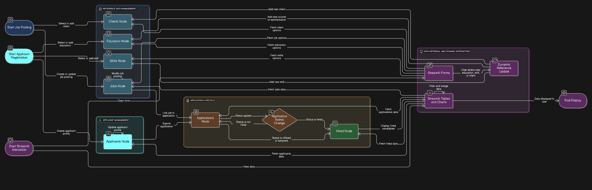

# **Applicant Manager**

*A Streamlit-based Applicant Tracking System with Firebase backend and Google Drive resume storage*

---

## 📌 **Overview**

**Applicant Manager** is a lightweight yet powerful **Applicant Tracking System (ATS)** designed to manage the complete recruitment lifecycle — from job posting to candidate hiring.
It was developed during an internship and is now production-ready for managing **job postings**, **applicants**, **applications**, and **hired records**.

**Key Features:**

* 📊 **Dashboard** with KPIs and hiring analytics
* 📝 **Add Applicant** with skill-based YOE tracking
* 💼 **Post Jobs** with custom hiring processes
* 🔗 **Link Applications** between jobs and candidates
* ✅ **Track & Mark Hires** with joining details and offered CTC
* 🔍 **Search & Filter** applicants and jobs in real-time
* 📂 **Resume Upload & Storage** via Google Drive
* 🔐 **Cookie-based Secure Authentication**

---

## 🏗 **Tech Stack & Data Flow**

* **Frontend & App Framework**: [Streamlit](https://streamlit.io)
* **Database**: Firebase Realtime Database
* **File Storage**: Google Drive API
* **Authentication**: bcrypt + Encrypted Cookies
* **Utilities**: nanoid (ID generation), Pandas (data processing)

The following diagram illustrates how data moves between the UI, Firebase, and Google Drive in the Applicant Manager system.


---

## 📸 **Screenshots**

*(Add screenshots of Dashboard, Add Applicant form, Job posting form, etc.)*

---

## 📂 **Project Structure**

```
applicant-manager/
│
├── main.py                     # Entry point & routing
├── pages/                      # Modular Streamlit pages
│   ├── dashboard.py
│   ├── add_applicant.py
│   ├── add_job.py
│   ├── view_applicants.py
│   └── ...
│
├── utils/
│   ├── firebase_helper.py       # Firebase CRUD operations
│   ├── auth.py                  # Authentication & session handling
│   ├── upload_resume.py         # Google Drive upload logic
│
├── requirements.txt
├── .env                         # Environment variables
└── README.md
```

---

## ⚙️ **Installation & Setup**

### **1️⃣ Clone the Repository**

```bash
git clone https://github.com/<your-username>/applicant-manager.git
cd applicant-manager
```

### **2️⃣ Create & Activate a Virtual Environment**

```bash
python -m venv venv
source venv/bin/activate  # For Windows: venv\Scripts\activate
```

### **3️⃣ Install Dependencies**

```bash
pip install -r requirements.txt
```

### **4️⃣ Configure Environment Variables**

Create a `.env` file in the project root:

```
cred_file=/path/to/firebase-service-account.json
folder_id=YOUR_GOOGLE_DRIVE_FOLDER_ID
user_file=users.json
COOKIES_PASSWORD=STRONG_SECRET_PASSWORD
```

### **5️⃣ Authenticate Google Drive**

First-time setup for Google Drive API:

```bash
python utils/upload_resume.py
```

This will open a browser for OAuth authentication and save a `token.pickle` file.

### **6️⃣ Run the Application**

```bash
streamlit run main.py
```

---

## 📊 **Core Features**

### **1. Dashboard**

* KPI Cards: Total Clients, Open Vacancies, Applicants, Job Posts
* Pie Charts: Vacancies by Department, Vacancies by Work Mode

### **2. Applicant Management**

* Add applicants with education hierarchy & per-skill YOE
* View, filter, search applicants
* Detailed applicant pages with update & delete options

### **3. Job Management**

* Post jobs with detailed descriptions & hiring stages
* View jobs in card or table format
* Bulk-assign applicants to jobs

### **4. Application Tracking**

* Track candidates through each hiring stage
* Bulk advance candidates in the pipeline
* Mark candidates as hired

### **5. Hired Records**

* Permanent log of all hires
* Details include offered CTC, joining date, notice period

---

## 🔒 **Security**

* Passwords are stored using **bcrypt hashing**
* Cookies are **AES encrypted** using a secret key from `.env`
* Firebase service credentials are **not committed** to GitHub

---

## 🚀 **Future Enhancements**

* Migrate to **Firebase Authentication** with RBAC
* Add **resume parsing** with NLP
* Implement **CSV/Excel export** for reporting
* Add **server-side pagination** for large datasets

---

## 👨‍💻 **Author**

**Nikhil Singhal**
Python Developer | Internship Project @ CodeStart Labs

